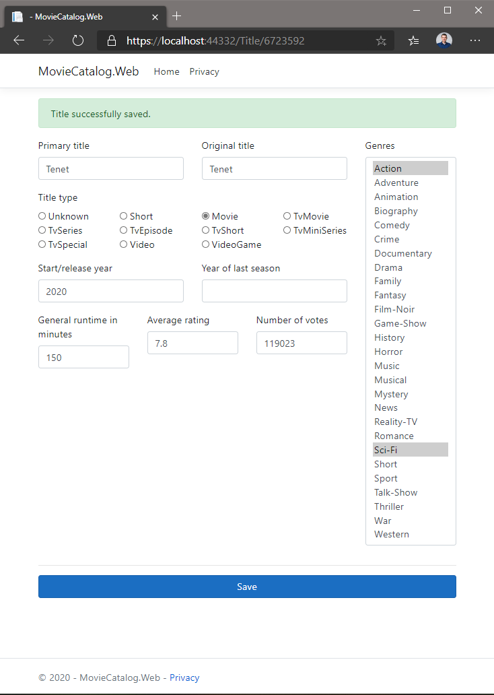

# Feladat 2.

A film kártyájáról lehessen elnavigálni egy új oldalra (pl. a címre kattintva vagy egy új ikonnal vagy linkkel), ahol a film adatait szerkeszthetjük.
- A szerkesztés önálló oldalon legyen, a `/Title/{Id:int?}` URL-en legyen elérhető!
- Legyen a nézet áttekinthető, lényegretörő!
- Az Id paraméter/tulajdonság tehát URL-ből jön (ha van), és GET kérés hatására is ki kell töltődnie.
- Ha Id nincs megadva, akkor egy üres Title létrehozását végezzük.
- Ha az Id meg van adva, a film adatait töltsd ki az adatbázis adatai alapján!
- Használd az `asp-for` adatkötést a tulajdonságok megjelenítéséhez!
- A mentés ugyanezen URL-en keresztül történjen, viszont POST művelet hatására végződjön el. Mentés után GET kéréssel menjünk vissza az oldal szerkesztő felületére (lásd: [PRG](https://en.wikipedia.org/wiki/Post/Redirect/Get)).
- Típusból csak egyet (rádiógomb-csoport vagy legördülő lista), műfajból többet (műfajonkénti checkbox vagy többkiválasztásos lista) is meg lehet adni.
- A műfajok listáját értelemszerűen külön lekérdezésben le kell kérdezni.
- A lehetséges típusok nevei elkérhetők (és kirajzolhatók) az alábbi módon:
    ``` HTML
    @foreach (var type in Enum.GetNames(typeof(MovieCatalog.Data.TitleType)))
    {
        <div class="col-4 col-md-3">
            @Html.RadioButtonFor(model => model.TitleType, type) @type<br />
        </div>
    }
    ```
Készíts validációt is az elemekre!
- Jelenítsd meg a validációs hibákat az `asp-validation-summary` Tag Helper segítségével!
- Mentés csak akkor történhet, ha a validáció sikeres volt (`ModelState.IsValid`)! Ha a modell állapota nem valid, a jelenlegi oldal visszaadásával az adatkötések megfelelően lefutnak és kitöltésre kerülnek a validációs hibák, a felületen megadott értékek pedig betöltődnek a megfelelő mezőkbe.
- Használhatod a [TempData](https://docs.microsoft.com/en-us/aspnet/core/fundamentals/app-state?view=aspnetcore-3.1#tempdata) objektumot adat átadására HTTP kérések között.
- Validációk:
    - Elsődleges cím: max 500 karakter, kötelező.
    - Évszámok: 1900 és 2100 között.
    - Futási idő (perc): min. 1.
    - Átlagos értékelés: 1 és 10 között, de opcionális.
    - Szavazatok száma: min. 0.
    - Műfajok: maximum 3.

Példa végeredmény:



Tippek:
- Használd az alábbi attribútumokat: `BindProperty`, `TempData`, `Display`, `Required`, `StringLength`, `Range`, `MaxLength`!
- Használd az [asp-items](https://docs.microsoft.com/en-us/aspnet/core/mvc/views/working-with-forms?view=aspnetcore-3.1#the-select-tag-helper) Tag Helpert a műfajok legördülőhöz! Több lehetséges elemhez a `<select>` `multiple` attribútumát használd! A `SelectListItem` konstruktorában tudod megadni, hogy ki legyen-e választva egy műfaj. A kiválasztott műfajok egyszerű `List<string>` típusban tárolhatók (és adhatók át a mentést végző metódusnak).

Kiindulásként használhatod az alábbi vázat:
``` HTML
@page "********"
@model MovieCatalog.Web.Pages.TitleModel

@{
    // Ide kerülhet az oldal felépítéséhez szükséges kód.
}

@if (Model.SuccessMessage != null)
{
    <div class="alert alert-success">@Model.SuccessMessage</div>
}

<form method="post">
    @if (!Model.ModelState.IsValid)
    {
        <div asp-validation-summary="All" class="alert alert-warning"></div>
    }

    <div class="form-group col-md-6">
        <label asp-for="PrimaryTitle"></label>
        <input asp-for="PrimaryTitle" class="form-control" />
    </div>

    @* ... *@

    <hr />

    <button class="btn btn-primary btn-block" type="submit">Save</button>
</form>
```

``` C#
public class TitleModel : PageModel
{
    public TitleModel(IMovieCatalogDataService dataService)
    {
        DataService = dataService;
    }

    public IMovieCatalogDataService DataService { get; }

    [BindProperty(SupportsGet = true)]
    public int? Id { get; set; }

    [TempData]
    public string SuccessMessage { get; set; }

    [BindProperty]
    [Display(Name = "Primary title")]
    [Required]
    [StringLength(500, ErrorMessage = "Title length must be maximum 500 characters.")]
    public string PrimaryTitle { get; set; }

    public async Task OnGetAsync()
    {
        if (Id != null)
        {
            PrimaryTitle = (await DataService.GetTitleByIdAsync(Id.Value)).PrimaryTitle;
        }
    }

    public async Task<IActionResult> OnPostAsync()
    {
        if (!ModelState.IsValid)
            return Page();

        var title = await DataService.InsertOrUpdateTitleAsync(Id, PrimaryTitle, default, default, default, default, default, default, default, default);

        SuccessMessage = $"Title successfully saved.";

        return RedirectToPage("/Title", new { title.Id });
    }
}

```

## Következő feladatok

A feladatokat tetszőleges sorrendben elvégezheted:

- [Lapozás](Feladat-3.md)

- [Szűrés](Feladat-4.md)
