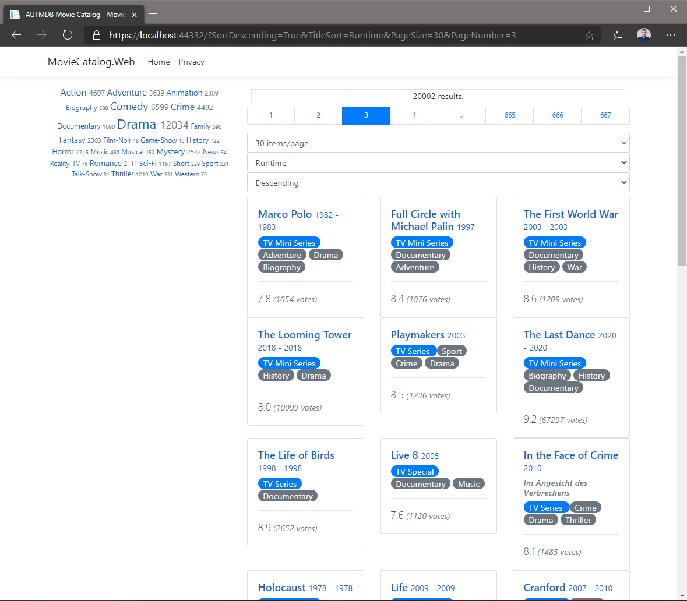

# Feladat 3.

A lapozást és rendezést a kezdőoldalon kell megvalósítani, minden paraméter URL-ben utazzon! A lapozáshoz az oldal tetején és/vagy alján kell szerepelnie egy lapozósávnak az alábbinak megfelelően:
- Legyen látható az összes találat száma.
- Legyen látható az aktuális oldalméret egy legördülő menüben, lehetséges értékei: 12, 30, 60, 120. Az alapérték 60. Újratöltés után mindig a megfelelő elem legyen kiválasztva!
- Az oldalméret változtatásakor az oldal töltődjön újra az első oldalon, az új oldalmérettel! Ehhez a JavaScriptes `onchange` eseménykezelőt lehet például használni. Egyszerű megoldás definiálni egy űrlapot, amiben a `select` szerepel a megfelelő paraméterekkel, valamint egy `hidden` `input`ot 1-es `PageNumber` értékkel. Ezután már csak a `select` `onchange`-ben kell megfelelően elsütni a `form` `submit` eseményét.
- Legyenek láthatók a lehetséges oldalszámok egy oldalválasztóval az alábbinak megfelelően:
    - Az első 3 oldal mindig legyen látható (ha van).
    - Az aktuális plusz/mínusz 1 oldal mindig legyen látható (ha van).
    - Az utolsó 3 oldal mindig legyen látható (ha van).
    - A további oldalakat három pont (...) jelzi, ahol kimaradás történik.
    - A ...-on kívüli elemekre kattintva a megfelelő oldal töltődik be. Fontos, hogy a PageSize paraméter értéke lapozáskor megmarad!
- Az oldalválasztóhoz javasolt (nem kötelező) a [Bootstrap Pagination](https://getbootstrap.com/docs/4.5/components/pagination/) komponenst használni.
- Az oldalszám technikailag az adatrétegből 0-tól indul, de a felületen/URL-ben 1-től induljon, tehát az eltolást a megfelelő helyeken alkalmazd!
- A rendezéshez két legördülő tartozik, amik bármelyikének változásának hatására az oldal az új paraméterekkel újratöltődik:
    - a TitleSort lehetséges értékei alapján,
    - Ascending/Descending, amely a SortAscending értékét állítja be megfelelően.
- A rendezés megadásakor az oldalméret nem változik, az oldalszám viszont 1-re állítódik.
- A paraméterek kölcsönös megtartásához (pl. lapozáskor az oldalméret és rendezés ne változzon; rendezéskor az oldalméret ne változzon) navigációkor használhatjuk az `asp-route-all-data` Tag Helpert, aminek átadhatjuk az aktuális query paraméterek szótárát; ezután felülírhatjuk a további értékeket:
    ``` HTML
    <a class="page-link"
        asp-all-route-data="Request.Query.ToDictionary(v => v.Key, v => v.Value?.ToString())"
        asp-route-PageNumber="@i">
        @i
    </a>
    ```
    Ugyanez a megoldás űrlapokon nem használható, ott az aktuális `QueryString` értéket kell feldolgozni, így például a [szűrési feltételeket](Feladat-4.md) is meg tudjuk tartani:
    ``` HTML
    <form method="get">
        <select asp-for="PageSize" class="form-control-sm" onchange="..." asp-items="@(...)">
        </select>
        @foreach (var (key, value) in Request.Query.Where(
            q => q.Key != nameof(Model.TitleSort) // ezt azért szűrjük ki, mert a select-ben állítjuk ugyanezen az űrlapon
            && q.Key != nameof(Model.PageNumber) // ezt pedig azért, mert rejtett mezőben 1-re állítjuk, hogy oldalméret váltásakor az első oldalra megyünk
            ))
        {
            <input type="hidden" name="@key" value="@value" />
        }
        <input type="hidden" asp-for="PageNumber" value="1" />
    </form>
    ```

Példa végeredmény (`/?SortDescending=True&TitleSort=Runtime&PageSize=30&PageNumber=3`):



## Következő feladatok

A feladatokat tetszőleges sorrendben elvégezheted:

- [Mű szerkesztő oldala](Feladat-2.md) (korábbi feladat)

- [Szűrés](Feladat-4.md)
